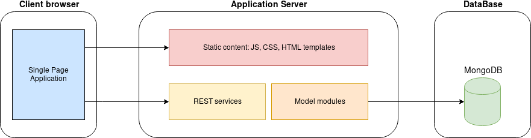

# Single Page Dashboard

This is a *boilerplate* project: a base for fast admin-dashboard prototype
applications.

It features:

- A REST web service with **MongoDB** as database backend.
- A customizable front-end with templates, i18n support and a **Bootstap 4**
  based UI.
- An architecture that support containers and desktop apps (using **Electon**).

*Note: this project is still in a early development stage; some parts or
features are still missing.*

## Background

Most administration dashboard applications share many features and structures:
user management with roles/privileges, a customized main menu (sidebar) for
different roles, some backend services with a database, etc.

As result, building a quick prototype for an idea carries a lot of code
repetition. This project tries to address the boiler plate by providing a base
structure and common functionality.

## Overall design

This application has three main parts:

### Single page application (static content)

The user interface is loaded only from static content: no processing is done
at server level. It uses plain HTML, CSS and JavaScript.

The interface is a **Bootstrap 4** admin dashboard with four separate
sections:

- A *Sidebar* for the main navigation menu. The options depends on the user's
  roles or preferences.
- A *Navigation bar* that includes dropdown menus (with icons) for the user
  profile/preferences, notifications.
- The main/content section where the content parts are rendered.
- A *Footer* bar with the build/version information (optional).

### REST services

The application exposes all the operations through the REST services.

### Model modules

The model/business modules are the core of the application. The can use a
database backend (included in this base code) or any other integration.

## Implementation detail

The current project is just a 'TO-DO list manager'; each list is called a
`Project`.

The sidebar shows four options:

- **Home**: the starting content (just a plain text card)
- **Projects**: the project list
- **API**: this section describes the REST services API for the projects
  and tasks
- **About**: another plain text card

## Usage

A general usage for this project could be:

- Clone the project
- Configure the application configuration
- Build the backend services
- Tune the backend tests
- Customize the UI: `index.html`, templates and the theme folder (`material` by default)

## Containers and desktop build

*Coming soon*.

## TO-DO

Some features to add:

- [ ] User management and authorization (with customized menu entries and
  views)
- [ ] Option for SQL database backends (probably using a DB abtraction
  library like [Knex.js](http://knexjs.org/))
- [ ] Live language switching

## License

This project is released under the [Apache 2.0](https://www.apache.org/licenses/LICENSE-2.0)
license.
